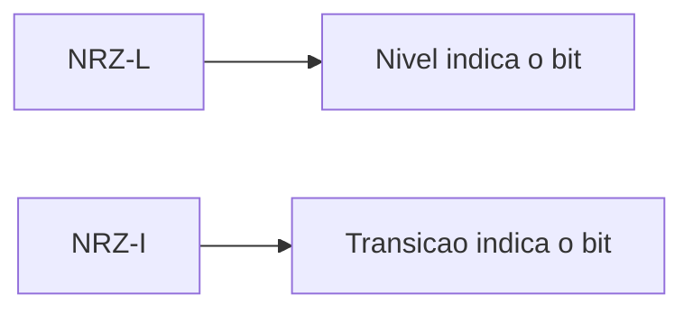

# Relatório Técnico

**Título:** Modulação Digital em VHDL: Implementações de NRZ-L e NRZ-I na placa Basys3

**Disciplina:** Comunicação de Dados - Sistemas Reconfiguráveis

**Instituição:** CEFSA

**Semestre:** 2026

**Professor:** [Nome do professor]

**Integrantes:**

- Edgar Camacho Seabra Ribeiro
- Henrico Birochi
- Nicholas Birochi
- Vitor A. Braghttoni

## Resumo

Este trabalho apresentou a implementação, em VHDL, de dois circuitos de modulação digital baseados em codificação Non-Return-to-Zero: NRZ-L e NRZ-I. O projeto foi desenvolvido para simulação no Vivado Simulator e para gravação na placa FPGA Basys3. Para isso, foram descritos e implementados módulos com entrada paralela de 16 bits, lógica de serialização sincronizada por clock e saída modulada observável em simulação e em hardware. O desenvolvimento incluiu a escrita dos testbenches, a definição dos arquivos de restrição de pinos e a verificação do comportamento do sinal em diferentes cenários. Como resultado, os dois módulos reproduziram o comportamento esperado das respectivas modulações, permitindo comparar a representação por nível e por transição. Também foram preparados recursos extras de saída para PMOD e VGA, ampliando as formas de observação do sinal gerado.

## 1. Introdução

A modulação digital constitui uma etapa central em sistemas de comunicação, pois permite representar informação binária em sinais elétricos adequados para transmissão, armazenamento ou exibição. Entre os esquemas mais simples e didáticos estão as codificações da família Non-Return-to-Zero, nas quais a informação é representada sem retorno à linha de base dentro de cada intervalo de bit.

Neste trabalho, foram implementadas as codificações **Unipolar NRZ-L** e **Unipolar NRZ-I** em linguagem VHDL. O objetivo geral consistiu em desenvolver dois circuitos funcionais, simuláveis e graváveis em FPGA, capazes de evidenciar as diferenças conceituais entre uma codificação baseada em nível e outra baseada em transição. Como objetivos específicos, buscaram-se a organização modular do código, a validação por simulação comportamental, a síntese para a placa Basys3 e a observação prática da saída em hardware.

O trabalho foi organizado de forma a conectar teoria e implementação. Primeiro, foram estudados os conceitos de modulação digital. Em seguida, os módulos foram escritos e testados em VHDL. Depois, o comportamento foi validado no Vivado Simulator e, por fim, os circuitos foram sintetizados, implementados e programados na FPGA.

## 2. Fundamentação teórica

As codificações NRZ-L e NRZ-I pertencem ao grupo de esquemas de linha usados para representar bits por níveis elétricos ao longo do tempo. Em ambos os casos, a informação é transportada sem retorno do sinal ao zero dentro de cada bit, o que simplifica a representação, mas também impõe limitações em sincronismo e detecção de transições.

Na codificação **NRZ-L**, o nível do pulso representa diretamente o valor binário. Em sua forma unipolar, o bit `1` é representado por nível alto e o bit `0` por nível baixo. A interpretação é imediata: a saída permanece no nível correspondente enquanto o intervalo do bit está ativo.

Na codificação **NRZ-I**, a informação é carregada por transição. O bit `1` provoca inversão do nível no início do intervalo de bit, enquanto o bit `0` preserva o estado anterior. Essa abordagem tende a facilitar a identificação de mudanças de estado em sequências específicas e é frequentemente associada a uma melhor presença de transições para recuperação temporal do sinal.

Em termos conceituais, a diferença entre os dois métodos está no critério de codificação. No NRZ-L, o receptor observa o nível instantâneo. No NRZ-I, o receptor observa a mudança relativa em relação ao nível anterior.

## 3. Metodologia

O desenvolvimento foi realizado em etapas encadeadas.

1. **Estudo teórico**: foram revisados os conceitos de modulação digital e as diferenças entre NRZ-L e NRZ-I.
2. **Implementação em VHDL**: foram escritos os módulos principais, os testbenches e os arquivos `.xdc` de mapeamento físico.
3. **Simulação**: os circuitos foram verificados no Vivado Simulator com uma sequência de 16 bits fixa nos testbenches.
4. **Síntese e implementação**: os projetos foram processados no Vivado para gerar a netlist e a implementação física da lógica.
5. **Gravação na placa**: o bitstream gerado foi aplicado na Basys3 via Hardware Manager.

As ferramentas utilizadas incluíram o **Vivado 2025.1**, a placa **Basys3**, a linguagem **VHDL** e as bibliotecas padrão **IEEE.STD_LOGIC_1164** e **IEEE.NUMERIC_STD**. A simulação foi conduzida com waveform viewer, o que permitiu inspecionar a evolução da saída, do contador interno e do índice do bit.

## 4. Desenvolvimento

### 4.1 Implementação do NRZ-L

O módulo NRZ-L foi estruturado como um serializador controlado por clock. A entrada `data_in` recebeu 16 bits em paralelo, e a saída `nrz_out` representou a codificação em nível. O circuito percorreu o vetor de entrada do bit mais significativo para o menos significativo, utilizando um ponteiro interno para selecionar a posição atual.

O tempo de permanência de cada bit foi controlado por um contador parametrizável. A decisão de usar um contador interno permitiu separar a frequência do clock da duração observada de cada bit. Em hardware, a lógica foi associada ao LED principal e também ao pino PMOD, o que possibilitou observação em placa e em instrumentação externa.

Uma decisão de projeto importante foi manter o comportamento determinístico do reset, reiniciando o ponteiro, o contador e a saída. Essa escolha simplificou a validação em simulação e reduziu ambiguidades na inicialização do circuito.

### 4.2 Implementação do NRZ-I

O módulo NRZ-I foi implementado com uma estratégia diferente. Em vez de associar o valor diretamente ao nível da saída, foi utilizado um sinal interno de memória de nível anterior. A cada início de novo intervalo de bit, o valor de `data_in` foi analisado: se o bit atual era `1`, o nível foi invertido; se era `0`, o nível foi mantido.

Essa abordagem exigiu o armazenamento do estado anterior da linha. A escolha foi adequada porque reproduziu a essência da codificação NRZ-I, em que a presença de transição define o bit e não apenas o nível absoluto. O mesmo esquema de ponteiro e contador foi reaproveitado, o que reduziu a complexidade estrutural do segundo módulo.

### 4.3 Testbenches e simulação

Os testbenches foram construídos com uma sequência fixa de 16 bits para permitir comparação direta entre as duas modulações. O clock foi gerado de forma periódica e o reset foi aplicado no início da simulação. A duração da simulação foi dimensionada para cobrir a leitura completa da sequência.

A simulação mostrou que o NRZ-L reproduziu o valor binário como nível estável ao longo do intervalo de bit, enquanto o NRZ-I alterou o estado apenas quando o bit atual era `1`. A comparação visual entre os dois waveforms foi útil para evidenciar a diferença conceitual entre nível e transição.

### 4.4 Decisões de projeto

Foram adotadas algumas decisões para tornar o projeto mais didático e observável:

- leitura do vetor de bits do MSB para o LSB, o que facilitou a correspondência com a sequência escrita nos switches;
- uso de um contador interno para parametrizar a duração do bit;
- exposição do índice do bit no waveform e em LEDs auxiliares;
- disponibilização de saída adicional para PMOD no NRZ-L;
- separação dos projetos em diretórios independentes para facilitar manutenção e comparação.

As principais dificuldades estiveram relacionadas à organização dos sinais na simulação, à definição correta do top level em cada projeto e à validação do comportamento temporal em hardware. Essas questões foram resolvidas pela revisão dos testbenches, pela conferência dos arquivos `.xdc` e pela observação dos sinais em waveform.

## 5. Resultados

### 5.1 Simulação

Os resultados da simulação foram registrados em vídeo no repositório, com identificação dos sinais principais: `clk`, `reset`, `data_in`, `nrz_out` e `bit_idx`.

Os arquivos de apoio estão em [/Assets](../Assets/), com destaque para [nrz-l-all-3-working.mov](../Assets/nrz-l-all-3-working.mov) e [nrz-i-explained.mov](../Assets/nrz-i-explained.mov).

### 5.2 Placa FPGA

Após a geração do bitstream, o projeto foi gravado na Basys3. A saída principal foi observada no LED correspondente, enquanto os switches foram usados para configurar a sequência de entrada.

As demonstrações em funcionamento estão em [/Assets](../Assets/), especialmente [tutorial-program-device.mp4](../Assets/tutorial-program-device.mp4) e [nrz-l-all-3-working.mov](../Assets/nrz-l-all-3-working.mov).

### 5.3 Extras opcionais

O projeto também previu saídas alternativas para PMOD e visualização VGA. Quando esses extras foram utilizados, os vídeos ficaram disponíveis no repositório para consulta.

Os registros correspondentes estão em [/Assets](../Assets/), com [nrz-i-pmod.mov](../Assets/nrz-i-pmod.mov) e [nrz-i-vga.mov](../Assets/nrz-i-vga.mov).

## 6. Análise e discussão

A comparação entre NRZ-L e NRZ-I mostrou que as duas codificações compartilham a mesma base estrutural, mas diferem no modo de interpretação do bit. O NRZ-L apresentou leitura mais direta, pois o nível da saída correspondeu ao valor do bit durante todo o intervalo. Isso simplificou a compreensão e a validação visual. Em contrapartida, o NRZ-I exigiu memória de estado, pois a informação foi representada pela transição relativa ao nível anterior.

Do ponto de vista de robustez da leitura temporal, o NRZ-I exibiu maior dependência da sequência anterior, o que tornou a visualização mais interessante para estudo de transições. Já o NRZ-L se mostrou mais intuitivo para fins introdutórios. Em ambos os casos, a implementação em FPGA confirmou o comportamento visto na simulação, o que indicou consistência entre o modelo comportamental e o hardware sintetizado.

A comparação entre simulação e placa mostrou boa correspondência funcional. Na simulação, os sinais foram observados com maior detalhe temporal, enquanto na placa a percepção ocorreu principalmente por LEDs e, quando aplicado, pela saída PMOD. O comportamento permaneceu coerente em ambas as plataformas, o que validou a lógica escrita em VHDL e o mapeamento físico dos sinais.

Os resultados observados indicaram que a arquitetura baseada em contador + ponteiro de bit foi adequada para os dois projetos. Essa solução permitiu reutilização de estrutura, menor complexidade de manutenção e facilidade de comparação entre os resultados.

## 7. Conclusões

O trabalho atingiu o objetivo de implementar e validar duas modulações digitais em VHDL sobre a placa Basys3. A experiência permitiu consolidar conceitos de codificação de linha, sincronismo por clock, simulação comportamental e fluxo básico de projeto em FPGA.

Como principais aprendizados, destacaram-se a importância do testbench para validação, a necessidade de um mapeamento físico correto e o papel do estado interno no NRZ-I. Também ficou evidente que pequenas diferenças na lógica de saída alteraram significativamente a forma de representar a informação binária.

Entre as limitações observadas, esteve a dependência de observação visual para interpretação de sinais em hardware e a necessidade de configurar a duração da simulação de acordo com os generics adotados. Como trabalhos futuros, foram considerados o refinamento da interface de entrada, a ampliação do conjunto de testes, o uso de uma interface de visualização mais elaborada e a exploração de outros esquemas de codificação digital.

## 8. Referências bibliográficas

[1] HAYKIN, Simon. _Communication Systems_. 4. ed. New York: John Wiley & Sons, 2001.

[2] PROAKIS, John G.; SALEHI, Masoud. _Digital Communications_. 5. ed. New York: McGraw-Hill, 2008.

[3] XILINX. _Vivado Design Suite User Guide_. Disponível em: <https://docs.amd.com/>. Acesso em: 28 maio 2026.

[4] DIGILENT. _Basys 3 Reference Manual_. Disponível em: <https://digilent.com/reference/>. Acesso em: 28 maio 2026.

[5] IEEE. _IEEE Standard VHDL Language Reference Manual_. IEEE Std 1076.

[6] IEEE. _IEEE Standard for VHDL Logic Systems_. IEEE Std 1164.

[7] REPOSITÓRIO DO PROJETO. _Modulação Digital em VHDL: NRZ-L e NRZ-I_. Código-fonte e documentação interna do trabalho.
